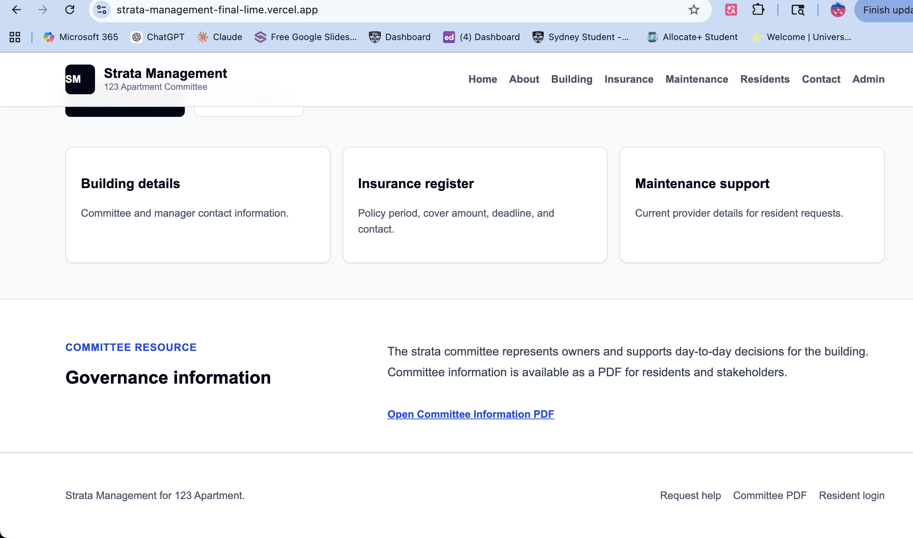
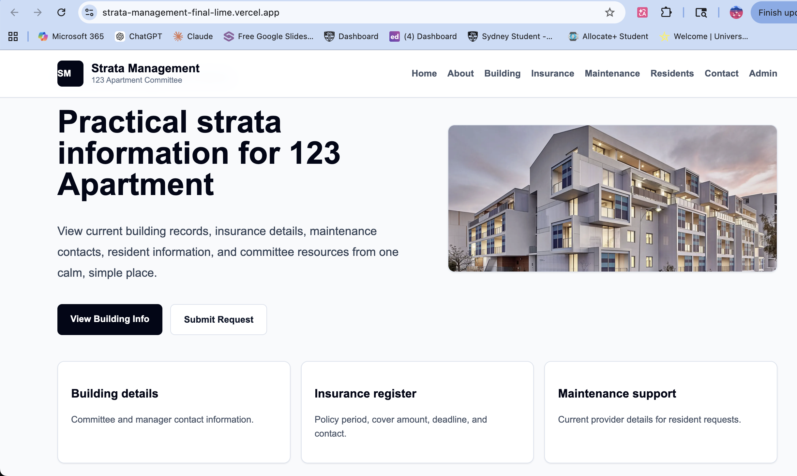

# Strata Management Portal

<p>
  <a href="#english">English</a> |
  <a href="#中文">中文</a>
</p>

<a id="english"></a>

## English

Live demo: https://strata-management-final-lime.vercel.app

GitHub: https://github.com/StellaYe1130/Strata-Management

A full-stack strata management web application for apartment residents and strata committee members. The project provides a resident-facing information portal and a protected management dashboard for handling resident records, building information, insurance details, maintenance contacts, and maintenance requests.

This project was built as a practical property-management system rather than a static website. It includes authentication, Row Level Security, CRUD workflows, database-backed contact requests, Vercel deployment, and a legacy Dockerized PHP microservice that demonstrates an earlier microservice-based architecture.

### Screenshots

#### Home Page



#### Portal Sections



### Core Features

- Resident and committee information portal
- Supabase Auth sign in and sign up
- Protected resident records page
- Admin allowlist controlled by Supabase Row Level Security
- Admin CRUD dashboard for residents, insurance, maintenance, and contact requests
- Search and status filtering in the admin dashboard
- Contact request workflow: `new -> in_progress -> resolved`
- Public maintenance request form stored in Supabase
- Building, insurance, maintenance, and committee information pages
- Vercel deployment with environment-based configuration
- Scheduled reminder endpoint configured through `vercel.json`
- Legacy PHP residents API containerized with Docker

### Tech Stack

- **Frontend:** Next.js App Router, React
- **Backend:** Next.js Route Handlers, Supabase Database
- **Auth:** Supabase Auth
- **Security:** Supabase Row Level Security
- **Deployment:** Vercel
- **Legacy Service:** PHP microservice with Docker
- **Styling:** Custom CSS utility layer in `app/globals.css`

### Architecture

Current production architecture:

```text
Browser
  -> Next.js App Router
  -> Next.js API Routes
  -> Supabase Auth
  -> Supabase Database with RLS
  -> Vercel Hosting
```

Legacy microservice architecture:

```text
Next.js app
  -> Dockerized PHP residents API
  -> JSON resident data
```

The PHP service is kept under `legacy/php-residents-service/` to demonstrate Docker and microservice experience. The current live application uses Supabase as the main data layer.

### AI Native Development Workflow

This project was developed with AI tools as part of the engineering workflow, not only for code generation. AI was used to:

- Break down product requirements into implementable tasks
- Debug local Next.js startup and environment issues
- Compare architecture options between a PHP microservice and a Supabase-backed full-stack app
- Draft and refine Supabase RLS policies
- Review Dockerfile and deployment configuration
- Improve bilingual documentation and resume-facing project descriptions

The final implementation was manually verified through login, protected-route access, admin CRUD operations, contact request submission, Supabase RLS behavior, Vercel deployment, and PHP service JSON output.

### Project Structure

```text
app/
  admin/                    Protected admin CRUD dashboard
  api/                      Next.js API routes
  components/               Shared header and footer
  contact/                  Maintenance request form
  login/                    Supabase Auth page
  residents/                Protected resident records
lib/
  supabaseClient.js         Browser Supabase client
  supabaseServer.js         Server-side Supabase helper
legacy/
  php-residents-service/    Dockerized PHP residents microservice
docs/
  screenshots/              Project screenshots
supabase-schema.sql         Supabase tables and RLS policies
vercel.json                 Vercel deployment and cron config
```

### Main Routes

| Route | Purpose |
| --- | --- |
| `/` | Home page |
| `/aboutus` | Portal overview |
| `/buildinginfo` | Building and manager information |
| `/insuranceinfo` | Insurance information |
| `/maintenanceinfo` | Maintenance provider information |
| `/residents` | Protected resident records |
| `/contact` | Public maintenance request form |
| `/login` | Supabase login and sign up |
| `/admin` | Protected admin dashboard |

### Business Workflow

The contact request flow models a lightweight operations workflow similar to ticket or order handling:

```text
Resident submits request
  -> Request stored in Supabase
  -> Admin reviews request
  -> Status changes from new to in_progress
  -> Admin marks request as resolved
```

This mirrors common back-office patterns used in e-commerce and operations systems, where staff need to search, filter, update, and resolve user-submitted records.

### Local Setup

Install dependencies:

```bash
npm install
```

Create `.env.local`:

```env
NEXT_PUBLIC_SUPABASE_URL=https://your-project-ref.supabase.co
NEXT_PUBLIC_SUPABASE_ANON_KEY=your-supabase-publishable-or-anon-key
Website_Name=Strata Management
```

Run the local development server:

```bash
npm run dev
```

Open:

```text
http://127.0.0.1:3001
```

### Supabase Setup

Create a Supabase project and run the SQL in:

```text
supabase-schema.sql
```

The schema creates:

- `Residents`
- `Insurance`
- `Maintenance`
- `building`
- `contact_requests`
- `admin_users`

It also enables Row Level Security and creates policies for public reads, authenticated resident access, contact request submissions, and admin-only management.

### Admin Access

After creating a Supabase Auth account, copy your user id from:

```text
Authentication -> Users
```

Then add yourself to the admin allowlist:

```sql
insert into public.admin_users (user_id)
values ('YOUR_AUTH_USER_ID');
```

After that, open:

```text
/admin
```

### Legacy PHP Docker Service

The project includes a legacy PHP residents API:

```text
legacy/php-residents-service/
```

Run with Docker:

```bash
cd legacy/php-residents-service
docker build -t strata-residents-php .
docker run --rm -p 8080:80 strata-residents-php
```

Open:

```text
http://localhost:8080/Residents.php
```

This service returns residents data as JSON and demonstrates how the project originally used a separate containerized microservice before migrating to Supabase.

### Deployment

The project is deployed on Vercel:

```text
https://strata-management-final-lime.vercel.app
```

Required Vercel environment variables:

```env
NEXT_PUBLIC_SUPABASE_URL
NEXT_PUBLIC_SUPABASE_ANON_KEY
Website_Name
```

### Resume Summary

Built and deployed a full-stack strata management portal using Next.js, Supabase Auth, Row Level Security, and Vercel. The system includes protected admin routes, CRUD dashboards, resident records, insurance and maintenance management, public contact request storage, and a legacy Dockerized PHP microservice showing earlier microservice architecture and containerization experience.

<p align="right"><a href="#strata-management-portal">Back to top</a></p>

---

<a id="中文"></a>

## 中文

<p>
  <a href="#english">English</a> |
  <a href="#中文">中文</a>
</p>

在线演示: https://strata-management-final-lime.vercel.app

GitHub: https://github.com/StellaYe1130/Strata-Management

这是一个面向公寓住户和业主委员会的全栈物业管理平台。项目提供住户端信息门户，以及受保护的后台管理系统，用于管理住户资料、楼宇信息、保险信息、维修联系人和维修请求。

这个项目不是静态展示页，而是一个更接近真实物业管理场景的 Web 应用。它包含登录认证、Row Level Security 权限控制、CRUD 工作流、数据库表单提交、Vercel 部署，以及一个用于展示早期微服务架构经验的 Dockerized PHP legacy service。

### 项目截图

#### 首页


#### 信息门户模块


### 核心功能

- 面向住户和业主委员会的信息门户
- Supabase Auth 登录与注册
- 受保护的住户资料页面
- 基于 Supabase Row Level Security 的管理员白名单
- 后台 CRUD 管理住户、保险、维修和联系请求
- 后台支持搜索、筛选和联系请求状态流转
- 联系请求工作流: `new -> in_progress -> resolved`
- 公开维修请求表单，并写入 Supabase 数据库
- 楼宇、保险、维修和委员会信息页面
- 使用 Vercel 部署，并通过环境变量配置
- 通过 `vercel.json` 配置定时提醒 API
- 保留 Dockerized PHP 住户数据微服务作为架构演进展示

### 技术栈

- **前端:** Next.js App Router, React
- **后端:** Next.js Route Handlers, Supabase Database
- **认证:** Supabase Auth
- **安全:** Supabase Row Level Security
- **部署:** Vercel
- **Legacy Service:** PHP microservice with Docker
- **样式:** `app/globals.css` 中的自定义 CSS utility layer

### 架构

当前线上架构:

```text
Browser
  -> Next.js App Router
  -> Next.js API Routes
  -> Supabase Auth
  -> Supabase Database with RLS
  -> Vercel Hosting
```

早期微服务架构:

```text
Next.js app
  -> Dockerized PHP residents API
  -> JSON resident data
```

当前线上版本使用 Supabase 作为主要数据层。PHP 服务保留在 `legacy/php-residents-service/` 中，用于展示项目早期的微服务方案和 Docker 容器化经验。

### AI Native 开发流程

本项目在开发过程中将 AI 工具作为工程工作流的一部分，而不仅仅用于生成代码。AI 主要用于:

- 将产品需求拆解为可实现的工程任务
- 辅助定位 Next.js 本地启动和环境配置问题
- 比较 PHP 微服务与 Supabase 全栈架构的取舍
- 设计和修正 Supabase RLS 权限策略
- 检查 Dockerfile 和部署配置
- 优化双语 README 与简历项目描述

最终功能通过登录、受保护路由、后台 CRUD、联系请求提交、Supabase RLS、Vercel 部署和 PHP JSON 服务输出进行了手动验证。

### 项目结构

```text
app/
  admin/                    受保护的后台 CRUD dashboard
  api/                      Next.js API routes
  components/               共享 Header 和 Footer
  contact/                  维修请求表单
  login/                    Supabase Auth 页面
  residents/                受保护的住户资料页面
lib/
  supabaseClient.js         浏览器端 Supabase client
  supabaseServer.js         服务端 Supabase helper
legacy/
  php-residents-service/    Dockerized PHP residents microservice
docs/
  screenshots/              项目截图
supabase-schema.sql         Supabase tables and RLS policies
vercel.json                 Vercel deployment and cron config
```

### 主要路由

| 路由 | 用途 |
| --- | --- |
| `/` | 首页 |
| `/aboutus` | 信息门户概览 |
| `/buildinginfo` | 楼宇和物业经理信息 |
| `/insuranceinfo` | 保险信息 |
| `/maintenanceinfo` | 维修服务商信息 |
| `/residents` | 受保护的住户资料 |
| `/contact` | 公开维修请求表单 |
| `/login` | Supabase 登录与注册 |
| `/admin` | 受保护的后台管理页面 |

### 业务流程

联系请求功能模拟了一个轻量级运营后台流程，类似电商系统中的售后工单或订单处理:

```text
住户提交请求
  -> 请求写入 Supabase
  -> 管理员查看请求
  -> 状态从 new 更新为 in_progress
  -> 管理员处理完成后标记为 resolved
```

该流程体现了后台系统中常见的搜索、筛选、状态更新和记录处理能力。

### 本地运行

安装依赖:

```bash
npm install
```

创建 `.env.local`:

```env
NEXT_PUBLIC_SUPABASE_URL=https://your-project-ref.supabase.co
NEXT_PUBLIC_SUPABASE_ANON_KEY=your-supabase-publishable-or-anon-key
Website_Name=Strata Management
```

启动本地开发服务器:

```bash
npm run dev
```

打开:

```text
http://127.0.0.1:3001
```

### Supabase 配置

创建 Supabase project，并运行以下文件中的 SQL:

```text
supabase-schema.sql
```

该 schema 会创建:

- `Residents`
- `Insurance`
- `Maintenance`
- `building`
- `contact_requests`
- `admin_users`

同时会启用 Row Level Security，并创建公开读取、登录住户访问、联系请求提交和管理员管理相关的权限策略。

### 管理员权限

创建 Supabase Auth 账号后，从以下位置复制 user id:

```text
Authentication -> Users
```

然后把自己加入管理员白名单:

```sql
insert into public.admin_users (user_id)
values ('YOUR_AUTH_USER_ID');
```

之后打开:

```text
/admin
```

### Legacy PHP Docker Service

项目中包含一个 legacy PHP residents API:

```text
legacy/php-residents-service/
```

使用 Docker 运行:

```bash
cd legacy/php-residents-service
docker build -t strata-residents-php .
docker run --rm -p 8080:80 strata-residents-php
```

打开:

```text
http://localhost:8080/Residents.php
```

这个服务会返回 JSON 格式的住户数据，用于展示项目从独立容器化微服务迁移到 Supabase 数据层之前的架构演进。

### 部署

项目部署在 Vercel:

```text
https://strata-management-final-lime.vercel.app
```

Vercel 需要配置以下环境变量:

```env
NEXT_PUBLIC_SUPABASE_URL
NEXT_PUBLIC_SUPABASE_ANON_KEY
Website_Name
```

### 简历项目描述

使用 Next.js、Supabase Auth、Row Level Security 和 Vercel 构建并部署了一个全栈分层物业管理平台，实现了受保护的后台路由、CRUD 管理面板、住户资料、保险和维修信息管理、公开联系请求存储，并保留 Dockerized PHP 微服务作为早期微服务架构和容器化经验展示。

<p align="right"><a href="#strata-management-portal">回到顶部</a></p>
